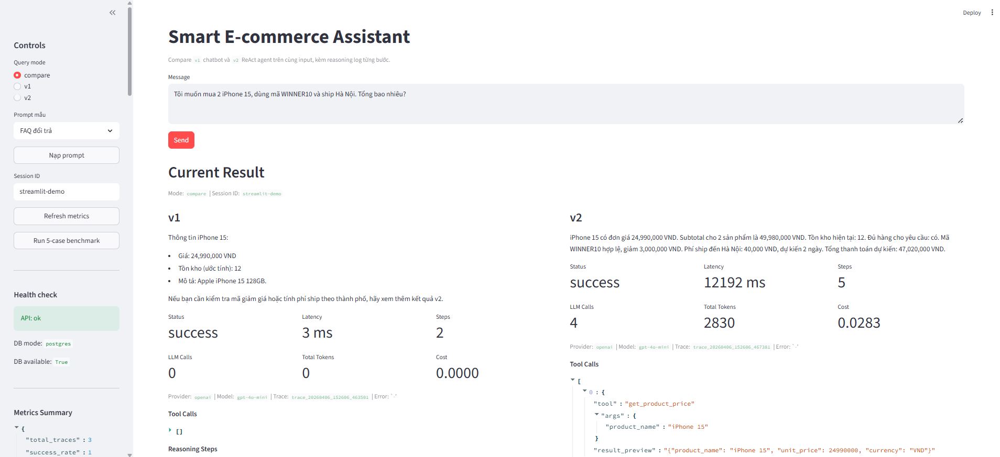

# Lab 3: Chatbot vs ReAct Agent (Industry Edition)

Welcome to Phase 3 of the Agentic AI course! This lab focuses on moving from a simple LLM Chatbot to a sophisticated **ReAct Agent** with industry-standard monitoring.

Our team currently runs this system with OpenAI using the `gpt-4o-mini` model.

## UI Preview

This is the Streamlit interface after the stack is running:



## Project Docs

Detailed project documentation is available in [docs/](docs/README.md):

- [docs/README.md](docs/README.md): overview of the documentation set
- [docs/architecture.md](docs/architecture.md): system architecture and module structure
- [docs/agent_versions.md](docs/agent_versions.md): comparison of `v1` baseline and `v2` agent
- [docs/database_schema.md](docs/database_schema.md): PostgreSQL schema and seed data
- [docs/api.md](docs/api.md): FastAPI endpoints and contracts
- [docs/use_case.md](docs/use_case.md): MVP use case and project scope
- [docs/flow.md](docs/flow.md): chatbot and agent execution flow
- [docs/logging.md](docs/logging.md): telemetry, trace, and logging conventions
- [docs/test_cases.md](docs/test_cases.md): benchmark and validation scenarios
- [docs/plan.md](docs/plan.md): implementation plan by phase
- [docs/todo.md](docs/todo.md): implementation checklist and remaining work
- [docs/compare_v1_v2_result.md](docs/compare_v1_v2_result.md): latest comparison report

## 🚀 Getting Started

### 1. Setup Environment

Copy the `.env.example` to `.env` and fill in your API keys:

```bash
cp .env.example .env
```

Recommended Python version (keep everyone consistent):

- `3.11` (see `.python-version`)
- Current runtime provider/model: `openai` + `gpt-4o-mini`

### 2. Run with Docker

This project is configured to run with Docker Compose using:

- PostgreSQL for product, inventory, coupon, shipping, and FAQ data
- FastAPI for backend APIs
- Streamlit for the demo UI

Start the full stack:

```bash
docker compose up -d --build
```

Current project runtime configuration:

- Provider: `openai`
- Model: `gpt-4o-mini`

Services after startup:

- FastAPI: `http://127.0.0.1:8000`
- Streamlit: `http://127.0.0.1:8501`
- PostgreSQL: `127.0.0.1:5432`

Useful Docker commands:

```bash
# check running containers
docker compose ps

# view logs
docker compose logs -f

# stop the stack
docker compose down
```

Quick scripts:

- Windows PowerShell: `./scripts/run_stack.ps1`
- macOS/Linux: `./scripts/run_stack.sh`

### 3. Start only PostgreSQL (optional)

If you only want the database and plan to run backend/frontend directly on your machine:

```bash
docker compose up -d postgres
```

Quick scripts:

- Windows PowerShell: `./scripts/run_postgres.ps1`
- macOS/Linux: `./scripts/run_postgres.sh`

### 4. Install Dependencies

```bash
pip install -r requirements.txt
```

### 5. Run Backend (FastAPI)

```bash
uvicorn src.api.main:app --reload --host 127.0.0.1 --port 8000
```

Quick scripts:

- Windows PowerShell: `./scripts/run_backend.ps1`
- macOS/Linux: `./scripts/run_backend.sh`

### 6. Run Frontend (Streamlit)

```bash
streamlit run streamlit_app.py --server.port 8501
```

Quick scripts:

- Windows PowerShell: `./scripts/run_frontend.ps1`
- macOS/Linux: `./scripts/run_frontend.sh`

### ✅ Quick Check for Phase 6-9

If Docker/Postgres is not available yet, the app will automatically fall back to bundled seed data (`fallback-seed`) so you can still demo locally.

Useful checks:

```bash
# API smoke test
pytest -q

# 5-case benchmark for v1 vs v2
python scripts/run_benchmark.py
```

What to expect:

- `/api/v1/health` returns `status: ok`
- `/api/v1/health` reports `database.mode: postgres` when Docker/PostgreSQL is available
- `streamlit_app.py` shows compare mode, history, and metrics summary
- `logs/benchmarks/benchmark_latest.json` is generated after running the benchmark

### 3. Directory Structure

- `src/tools/`: Extension point for your custom tools.

## 🏠 Running with Local Models (CPU)

If you don't want to use OpenAI or Gemini, you can run open-source models (like Phi-3) directly on your CPU using `llama-cpp-python`.

### 1. Download the Model

Download the **Phi-3-mini-4k-instruct-q4.gguf** (approx 2.2GB) from Hugging Face:

- [Phi-3-mini-4k-instruct-GGUF](https://huggingface.co/microsoft/Phi-3-mini-4k-instruct-gguf)
- Direct Download: [phi-3-mini-4k-instruct-q4.gguf](https://huggingface.co/microsoft/Phi-3-mini-4k-instruct-gguf/resolve/main/Phi-3-mini-4k-instruct-q4.gguf)

### 2. Place Model in Project

Create a `models/` folder in the root and move the downloaded `.gguf` file there.

### 3. Update `.env`

Change your `DEFAULT_PROVIDER` and set the path:

```env
DEFAULT_PROVIDER=local
LOCAL_MODEL_PATH=./models/Phi-3-mini-4k-instruct-q4.gguf
```

## 🎯 Lab Objectives

1. **Baseline Chatbot**: Observe the limitations of a standard LLM when faced with multi-step reasoning.
2. **ReAct Loop**: Implement the `Thought-Action-Observation` cycle in `src/agent/agent.py`.
3. **Provider Switching**: Swap between OpenAI and Gemini seamlessly using the `LLMProvider` interface.
4. **Failure Analysis**: Use the structured logs in `logs/` to identify why the agent fails (hallucinations, parsing errors).
5. **Grading & Bonus**: Follow `SCORING.md` in the course materials to maximize your points and explore bonus metrics.

## 🛠️ How to Use This Baseline

The code is designed as a **Production Prototype**. It includes:

- **Telemetry**: Every action is logged in JSON format for later analysis.
- **Robust Provider Pattern**: Easily extendable to any LLM API.
- **Clean Skeletons**: Focus on the logic that matters—the agent's reasoning process.

---

*Happy Coding! Let's build agents that actually work.*
