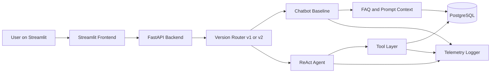

# Architecture

## Mục tiêu hệ thống

Xây dựng một MVP "Smart E-commerce Assistant" có 2 mode chạy trên cùng một nền tảng:

- `v1` chatbot baseline: phù hợp câu hỏi đơn giản, 1 bước
- `v2` ReAct agent: phù hợp query nhiều bước, cần gọi tool

Hệ thống phải cho phép:

- so sánh trực tiếp đầu ra của `v1` và `v2`
- đo latency, số bước, tool calls, failure type
- lưu trace chi tiết để phân tích sau

## Kiến trúc tổng thể



## Thành phần chính

### 1. Streamlit Frontend

Trách nhiệm:

- nhập câu hỏi người dùng
- chọn mode `v1` hoặc `v2`
- hiển thị câu trả lời
- hiển thị metrics:
  - latency
  - steps
  - tool calls
  - trace id
- hiển thị transcript hoặc trace ngắn để demo

### 2. FastAPI Backend

Trách nhiệm:

- cung cấp API chat chung cho frontend
- route request dựa trên `VERSION`
- expose tool endpoints
- dùng chung business logic giữa API và agent
- ghi telemetry theo chuẩn JSON

### 3. ReAct Agent

Trách nhiệm:

- nhận user query
- lập kế hoạch từng bước
- chọn đúng tool
- feed observation quay lại prompt
- dừng đúng lúc
- trả final answer

### 4. PostgreSQL

Trách nhiệm:

- lưu catalog sản phẩm
- lưu tồn kho
- lưu coupon
- lưu shipping rules
- lưu FAQ
- có thể lưu quote history và trace summary nếu cần

## Kiến trúc module đề xuất

```text
src/
  api/
    main.py
    routes/
      chat.py
      products.py
      tools.py
      health.py
  agent/
    agent.py
    prompts.py
    parser.py
    tools_registry.py
  chatbot/
    chatbot.py
    prompts.py
  core/
    config.py
    llm_provider.py
    openai_provider.py
    gemini_provider.py
    local_provider.py
  db/
    session.py
    models.py
    repositories/
      product_repo.py
      coupon_repo.py
      shipping_repo.py
      faq_repo.py
  services/
    pricing_service.py
    stock_service.py
    shipping_service.py
    faq_service.py
    quote_service.py
  telemetry/
    logger.py
    metrics.py
    trace_store.py
```

## Luồng request chung

1. Streamlit gửi request đến `POST /chat`
2. Backend đọc `VERSION`
3. Nếu `v1`, gọi chatbot baseline
4. Nếu `v2`, gọi ReAct agent
5. Cả hai mode đều trả cùng response schema
6. Telemetry được ghi cho toàn bộ request

## Nguyên tắc thiết kế để so sánh tốt

- Không cho `v1` chạy multi-step tool loop
- Không để `v2` dùng dữ liệu ngoài hệ thống nếu `v1` không có
- Dùng chung business services cho tool execution để tránh lệch logic
- Trả về cùng cấu trúc JSON để frontend render thống nhất

## Response schema chuẩn

```json
{
  "version": "v1",
  "answer": "Chính sách đổi trả là ...",
  "latency_ms": 842,
  "steps": 1,
  "tool_calls": [],
  "trace_id": "trace_20260406_001",
  "status": "success"
}
```

Ví dụ `v2`:

```json
{
  "version": "v2",
  "answer": "Tổng đơn hàng là 52,490,000 VND.",
  "latency_ms": 2410,
  "steps": 3,
  "tool_calls": [
    {
      "tool": "get_product_price",
      "args": {
        "product_name": "iPhone 15"
      },
      "result_preview": "price=24990000"
    }
  ],
  "trace_id": "trace_20260406_019",
  "status": "success"
}
```
