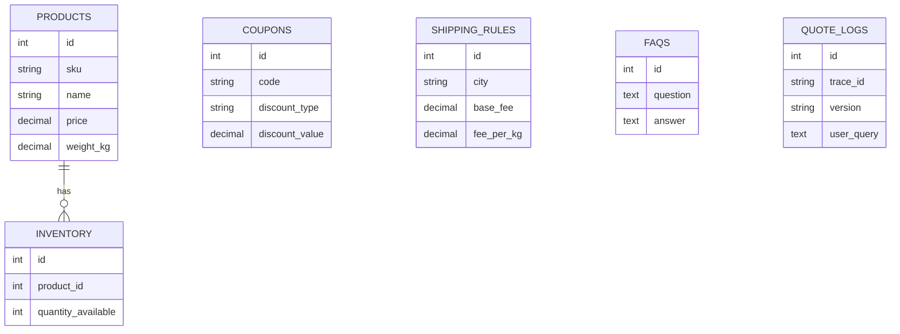

# Database Schema

## Mục tiêu

Schema tối thiểu nhưng đủ để:

- chatbot trả lời FAQ và product info cơ bản
- agent tính giá nhiều bước
- tạo được 5 test cases đa dạng

Database: PostgreSQL

Chạy bằng Docker Compose.

## Danh sách bảng

### 1. `products`

Lưu thông tin sản phẩm.

| Column      | Type               | Notes                        |
| ----------- | ------------------ | ---------------------------- |
| id          | serial pk          | khóa chính                   |
| sku         | varchar(50) unique | mã sản phẩm                  |
| name        | varchar(255)       | tên hiển thị                 |
| category    | varchar(100)       | điện thoại, laptop, phụ kiện |
| price       | numeric(12,2)      | giá bán                      |
| weight_kg   | numeric(8,2)       | dùng tính shipping           |
| description | text               | mô tả ngắn                   |
| is_active   | boolean            | bật/tắt                      |
| created_at  | timestamp          | mặc định now()               |
| updated_at  | timestamp          | mặc định now()               |

### 2. `inventory`

Lưu tồn kho theo sản phẩm.

| Column             | Type                  | Notes               |
| ------------------ | --------------------- | ------------------- |
| id                 | serial pk             | khóa chính          |
| product_id         | int fk -> products.id | sản phẩm            |
| quantity_available | int                   | số lượng còn        |
| reserved_quantity  | int                   | số lượng đã giữ chỗ |
| warehouse_name     | varchar(100)          | kho mặc định        |
| updated_at         | timestamp             | cập nhật gần nhất   |

### 3. `coupons`

Lưu mã giảm giá.

| Column          | Type               | Notes                  |
| --------------- | ------------------ | ---------------------- |
| id              | serial pk          | khóa chính             |
| code            | varchar(50) unique | ví dụ `WINNER10`       |
| discount_type   | varchar(20)        | `percent` hoặc `fixed` |
| discount_value  | numeric(12,2)      | 10 hoặc 50000          |
| min_order_value | numeric(12,2)      | giá trị đơn tối thiểu  |
| max_discount    | numeric(12,2) null | trần giảm              |
| is_active       | boolean            | hiệu lực               |
| expires_at      | timestamp null     | ngày hết hạn           |
| created_at      | timestamp          | mặc định now()         |

### 4. `shipping_rules`

Lưu luật tính phí ship.

| Column         | Type          | Notes                   |
| -------------- | ------------- | ----------------------- |
| id             | serial pk     | khóa chính              |
| city           | varchar(100)  | Hà Nội, TP.HCM, Đà Nẵng |
| base_fee       | numeric(12,2) | phí cơ bản              |
| fee_per_kg     | numeric(12,2) | phí mỗi kg              |
| estimated_days | int           | số ngày dự kiến         |
| is_active      | boolean       | hiệu lực                |

### 5. `faqs`

Lưu các câu hỏi và câu trả lời chuẩn cho chatbot.

| Column    | Type         | Notes                      |
| --------- | ------------ | -------------------------- |
| id        | serial pk    | khóa chính                 |
| question  | text         | câu hỏi gốc                |
| answer    | text         | câu trả lời chuẩn          |
| topic     | varchar(100) | shipping, return, warranty |
| is_active | boolean      | hiệu lực                   |

### 6. `quote_logs`

| Column       | Type               | Notes                |
| ------------ | ------------------ | -------------------- |
| id           | serial pk          | khóa chính           |
| trace_id     | varchar(100)       | liên kết telemetry   |
| version      | varchar(10)        | `v1` hoặc `v2`       |
| user_query   | text               | input gốc            |
| final_answer | text               | output               |
| success      | boolean            | thành công hay không |
| total_amount | numeric(12,2) null | nếu có báo giá       |
| created_at   | timestamp          | mặc định now()       |

## Quan hệ

## Seed data tối thiểu

### Products

- iPhone 15, 24,990,000, 0.5kg
- Samsung S24, 22,990,000, 0.5kg
- MacBook Air M3, 28,990,000, 1.3kg
- AirPods Pro 2, 5,490,000, 0.2kg
- Logitech MX Master 3S, 2,490,000, 0.3kg

### Inventory

- iPhone 15: 12
- Samsung S24: 8
- MacBook Air M3: 4
- AirPods Pro 2: 20
- Logitech MX Master 3S: 15

### Coupons

- `WINNER10`: giảm 10%, đơn tối thiểu 5,000,000, max 3,000,000
- `SHIP50`: giảm cố định 50,000, đơn tối thiểu 1,000,000
- `LUXE5`: giảm 5%, đơn tối thiểu 20,000,000

### Shipping rules

- Hà Nội: base 30,000, fee_per_kg 10,000, 2 ngày
- TP.HCM: base 35,000, fee_per_kg 12,000, 2 ngày
- Đà Nẵng: base 40,000, fee_per_kg 15,000, 3 ngày

### FAQs

- Chính sách đổi trả
- Bảo hành sản phẩm
- Giao hàng cuối tuần
- Thời gian xử lý đơn
- Hướng dẫn dùng mã giảm giá

## Query patterns cần hỗ trợ

- tìm sản phẩm theo tên
- lấy giá sản phẩm
- kiểm tra tồn kho theo số lượng yêu cầu
- kiểm tra coupon hợp lệ
- tính shipping theo thành phố và tổng trọng lượng

## Gợi ý chỉ mục

- `products(name)`
- `products(sku)`
- `coupons(code)`
- `shipping_rules(city)`
- `faqs(topic)`

## Docker notes

Nên mount 1 file `init.sql` để:

- tạo schema
- insert seed data
- giúp mọi thành viên có cùng dataset để benchmark

