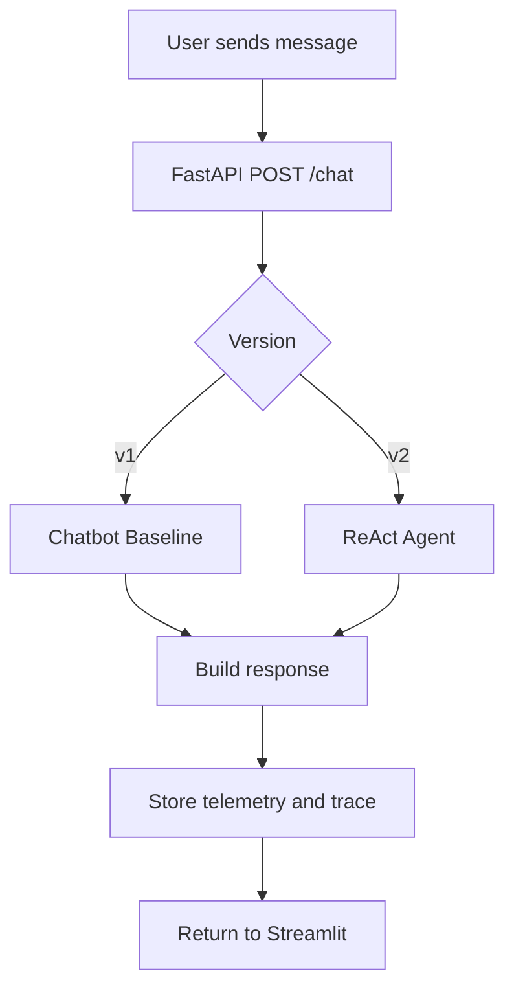
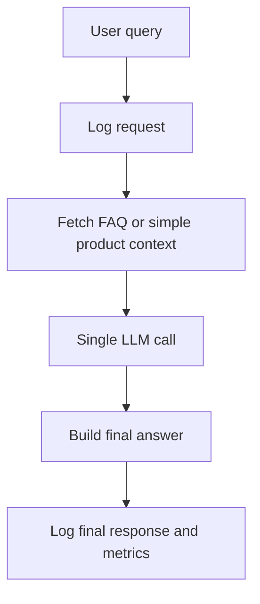
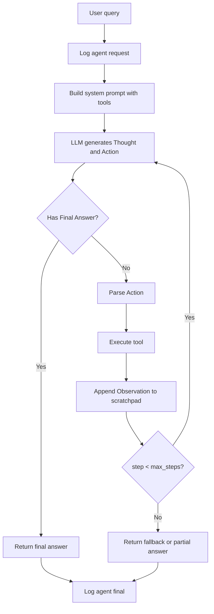

# Flow

## Mục tiêu

Tài liệu này mô tả luồng xử lý cho:

- `v1` chatbot baseline
- `v2` ReAct agent

Mục tiêu là giữ cùng entrypoint nhưng khác orchestration để so sánh rõ ràng.

## Luồng tổng thể

## Flow `v1` chatbot

### Ý tưởng

`v1` phải đơn giản và nhanh:

- nhận user input
- lấy một ít context nội bộ nếu cần
- prompt model để trả lời trực tiếp
- không loop nhiều bước

### Các bước

1. Nhận câu hỏi từ user
2. Ghi `CHATBOT_REQUEST_RECEIVED`
3. Phân loại sơ bộ:
   - FAQ
   - product info đơn giản
   - quote query nhiều bước
4. Lấy context ngắn:
   - FAQ liên quan
   - product snippets nếu có
5. Gọi LLM 1 lần
6. Ghi `CHATBOT_LLM_RESPONSE`
7. Trả câu trả lời
8. Ghi `CHATBOT_FINAL`

### Flowchart `v1`

## Flow `v2` ReAct agent

### Ý tưởng

`v2` phải xử lý multi-step bằng tool:

- model suy nghĩ bước tiếp theo
- chọn action
- backend chạy tool
- observation được đưa lại vào prompt
- lặp đến khi đủ dữ liệu

### Các bước

1. Nhận câu hỏi từ user
2. Ghi `AGENT_REQUEST_RECEIVED`
3. Khởi tạo state:
   - `trace_id`
   - `step = 0`
   - `scratchpad = []`
4. Gọi LLM với system prompt chứa:
   - role
   - tool descriptions
   - output format
   - stopping rule
5. Parse output:
   - nếu `Final Answer`, kết thúc
   - nếu `Action`, chuyển sang bước gọi tool
6. Thực thi tool
7. Ghi `TOOL_EXECUTED`
8. Append observation vào scratchpad
9. Tăng `step`
10. Nếu `step >= max_steps`, dừng với fallback
11. Trả final answer
12. Ghi `AGENT_FINAL`

### Flowchart `v2`

## Điểm agent thực sự tạo giá trị

Agent tạo giá trị tại 3 điểm:

### 1. Chọn tool đúng theo state hiện tại

Ví dụ:

- trước tiên lấy giá
- sau đó kiểm tra stock
- sau đó áp coupon
- cuối cùng tính shipping

### 2. Dùng observation thật thay vì suy đoán

Ví dụ:

- không "đoán" còn hàng
- không "đoán" mã giảm giá hợp lệ
- không "đoán" phí ship

### 3. Xử lý lỗi có kiểm soát

Ví dụ:

- coupon không tồn tại
- sản phẩm không đủ hàng
- city không có shipping rule

## Stopping condition

Agent cần dừng khi:

- đã có đủ dữ liệu để trả final answer
- tool trả lỗi không thể hồi phục
- vượt `max_steps`

Khuyến nghị:

- `max_steps = 5`
- nếu vượt ngưỡng, trả:
  - thông tin đã biết
  - lý do chưa hoàn tất
  - gợi ý người dùng nhập lại rõ hơn

## Fallback behavior

### Với `v1`

- nếu không chắc chắn, trả lời:
  - thông tin hiện có
  - yêu cầu user nêu rõ tên sản phẩm hoặc mã giảm giá

### Với `v2`

- nếu parse lỗi hoặc tool lỗi:
  - log error code
  - dừng an toàn
  - không bịa thêm dữ liệu

## Quy tắc giữ so sánh công bằng

- `v1` chỉ 1 LLM pass
- `v2` được phép nhiều loop
- cả hai dùng cùng DB
- cả hai dùng cùng response schema
